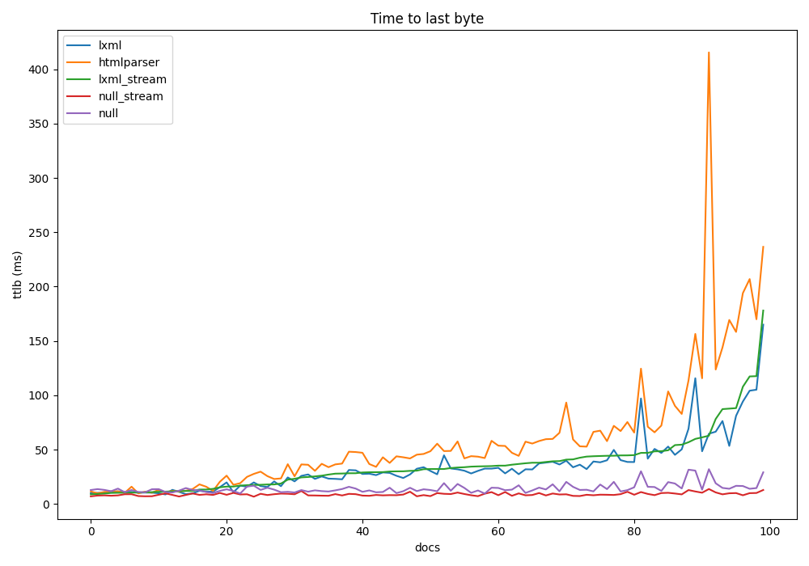
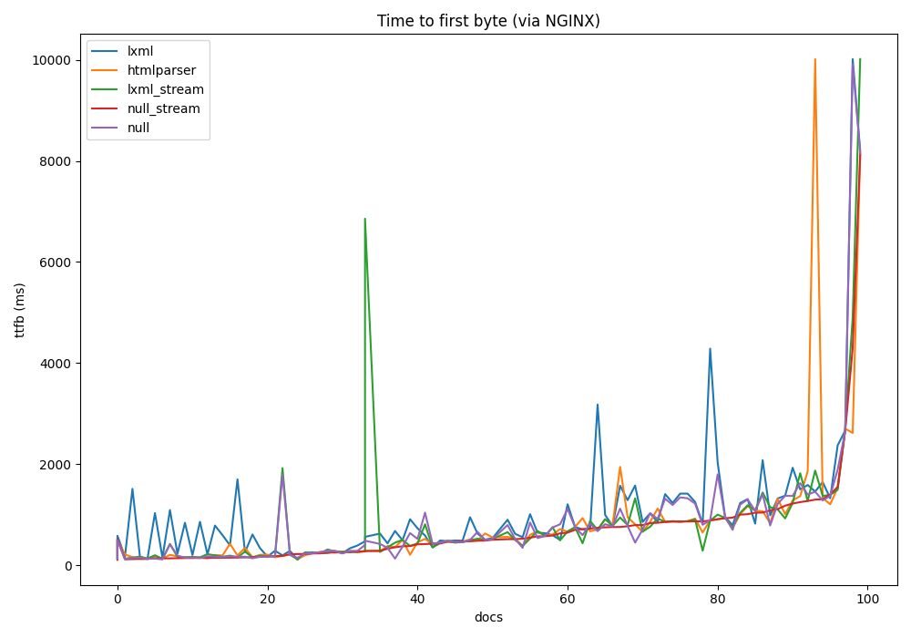
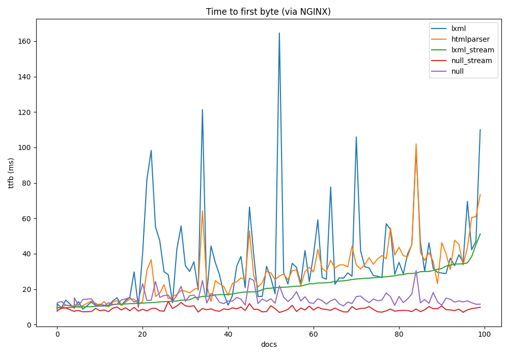
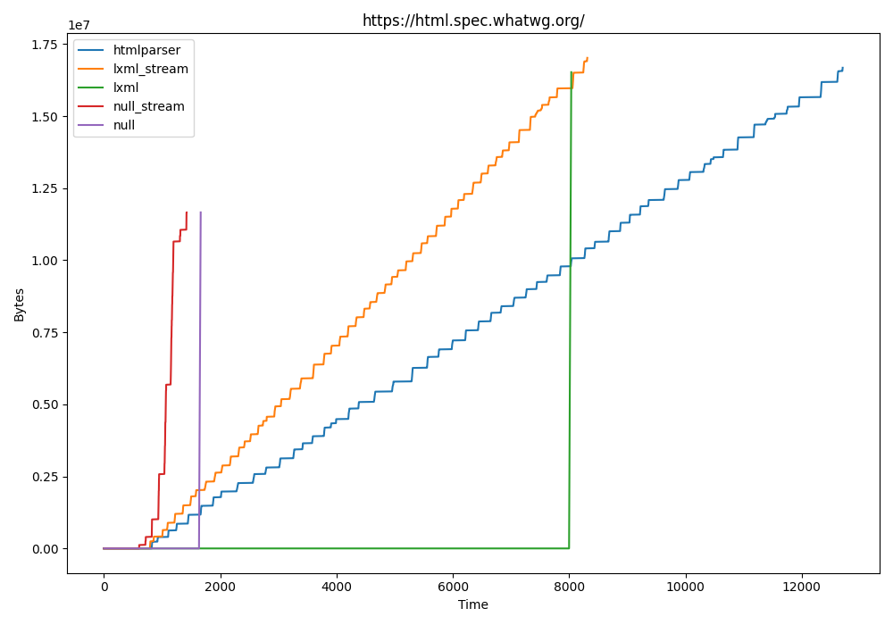
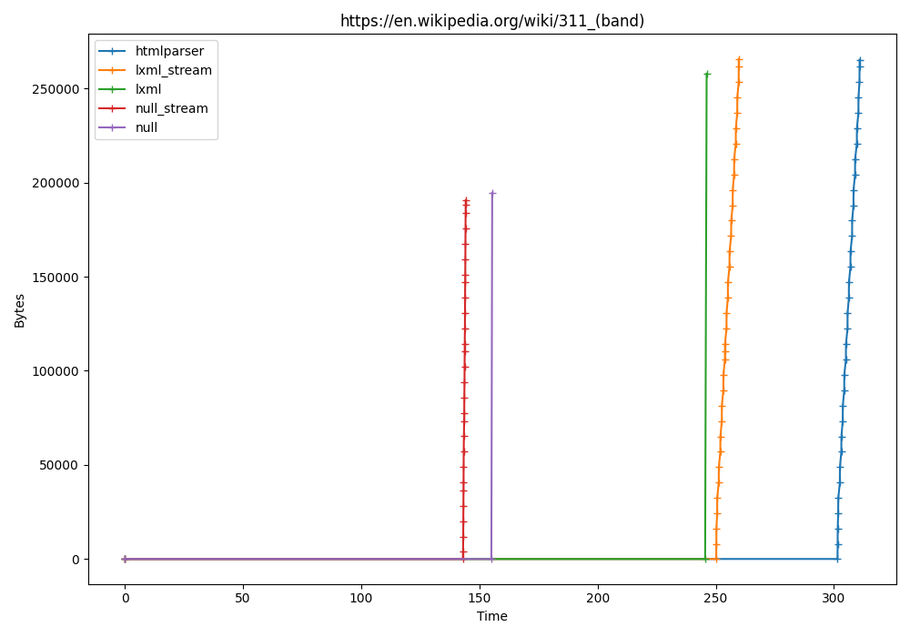

# Speed comparisons

## Overview

This document shows the results of various speed comparisons between the 
different techniques.

This document covers:

 * Time to first byte
 * Time to last byte
 * Streaming profiles (when bytes show up for a given document)
 * Chunk size effects
 * Other misc observations
 
### This document is mostly irrelevant

Sadly, most of this work isn't hugely important as disqualifying features of
the LXML solution mean I don't think we can use it. 

This is a huge shame, because as you will see, it's much faster.

### This is not an apples-to-apples comparison

When reading these comparisons bear the following in mind:

 * The `lxml` solution is not streaming. It downloads the entire payload,
  transforms and serialises it
 * The `lxml` solution is also doing much more than the others. It performs 
 inline style and CSS rewriting, which the others don't yet attempt
 * The `htmlparser` and `lxml_stream` are feature comparable and rewrite the
  page
 * The `null` solution only injects the client
 * The `null_stream` doesn't even do that, but does stream the content

Long story short, this isn't for the most part apples to apples (except kind 
of `htmlparser` and `lxml_stream`)

# Time to last byte

The following is a result of running over the full set and skipping the 
broken ones which results in 893 docs. These docs are all being retrieved 
from local NGINX direct from the file system.

Chunk size: 4k in, 4k out

Method | Time (ms) | Per doc
-------|-----------|---------
(direct_retrieve) | 4,122 | 5
(null rewriter) | 15,273 | 17
lxml | 33,307 | 37
lxml_stream | 35,955 | 40
html_parser | 71,163 | 80

Chunk size: 64k in, 16k out
 
Method | Time (ms) | Per doc
-------|-----------|---------
(direct_retrieve) | 3,274 | 4
(null_stream) | 8,839 | 10
(null) | 13,279 | 15
lxml | 32,977 | 37
lxml_stream | 33,834 | 38
htmlparser | 49,815 | 56

As you can see the chunk size has a massive effect on htmlparser. It's still 
the worst, but it's not quite as bad.

For a more detailed break down here are the times across 100 documents sorted 
by the time taken by the `lxml_stream` solution (all run through NGINX 
locally):

The story here is pretty clear:

 * The null solutions are very fast as we'd expect (they don't do much)
 * The two `lxml` solutions are actually very similar with the non streaming
  solution usually faster
 * This is actually a good showing for `lxml` and suggests it's running even 
 faster than the `lxml_streaming` solution for a few reasons:
    * It's doing more: This solution rewrites more things
    * It has to do it's reading, rewriting and rewriting in phases, meaning no 
    parallelisation
    * This means it's likely doing each faster (probably serialisation in 
    particular, as it's all C)
    * It could be benefiting from processing the data as a batch (it's simpler)
 * `htmlparser` is significantly slower

# Time to first byte

I tried to get some figures about the time to first byte using real websites,
 but there's too much variability between runs to make much sense of it. You'd 
 need to do many iterations, and it would take hours. Here's an example:

There are kind of some trends in there:

 * The non streaming LXML parser is the slowest as we'd expect
 * The difference between streaming and non-streaming is often smaller than 
 you'd expect
 * This suggests a significant portion of time is spent initiating connections,
 reading the headers, setting up classes etc
 * SSL verification will be one example which from the UK often takes about 
 200ms every time

To solve the variability issue the documents were run via NGINX locally. This
smooths out a lot of the kinks and shows the overhead of the techniques more
clearly:

In this figure all documents were sorted by the time taken for the 
`lxml_stream` solution which is why that looks so smooth. The trends here are 
more obvious:

 * The comparison solutions `null` and `null_stream` are the baseline 
 * Rarely is anything better than the `lxml_streaming` option
 * The full `lxml` parsed solution is definitely slowest (for first byte only, 
 remember in the case of LXML, this is likely close to the last byte too)

The same graph but with only the two real streaming solutions:

I'd say the `lxml_streaming` solution is reliably faster at getting content to
the screen.

# Streaming profiles

To try and gain an idea of the different performance of different websites I
tried running streaming profiles of them to show when bytes arrived over time.

The first and clearest example of the behavior is a very large website:

This is kind of the perfect picture to explain the differences between the
techniques. Some observations:

 * There is an initial connection/overhead phase were we don't get any content
 * This can vary wildly between runs, so it's hard to directly compare examples
 * The streaming and non streaming versions of the same thing tend to finish
 around the same time
 * The LXML example is particularly stiking. The non streaming one finishes
 slightly faster, but you get all of your content in one go. The streaming
 version has been sending content almost the entire time
 * The two real streaming solutions have similar profiles, but different
 performance, which adds up to a significant distance over time

Not sure why the null solutions returned fewer bytes though. I would expect
slightly less from the null streaming solution, as it doesn't inject anything
but not a great deal.

That is an absolutely huge site though. A still big but smaller site:

This graph includes ticks every time data was received.

The picture here is less clear:

 * The initial phase is much more relevant to the overall performance
 * We can see hitches in the null streaming solution, presumably showing times
 where the other side was waiting
 * We can see a long hitch in both streaming parsers - Not sure about that
 * Generally the effect of streaming is diminished the smaller the site is

For a reasonably sized site:

Here the initial phase is really the dominant factor. Running this again would
get you a different order every time, although the average order is relatively
clear:

 * Nulls first
 * Both LXMLS
 * HTMLParser
 
# Misc observations

## Chunk size in

The chunk size in seems to effect performance (particularly for HTMLParser),
but there's no clear winner. 8k might be consistently excellent for one site,
but consistently bad on another.

In general I can say:

 * Bigger is better, with diminishing returns (16k+)
 * Very small is consistently awful (128 bytes is straight bad)
 * Things in between are sometimes the best, sometimes not

It might have something to do with the sizes matching (or not) the sizes
received from external sites. I think some sites don't stream at all.

The best was 64k in general, although `lxml` was less sensitive and worked
well with a wider range.

## Chunk size out

Chunk size out is a little weirder. We're doing internal buffering but
it might be better not to. I haven't tried it. We will need some buffering
for in-line CSS parsing for example, as we can't look for URLs without
collecting a certain amount together.

It still has an effect, but setting it to match the default 64k actually made
things worse. 16k seemed like the sweet spot. Who could say why.

## Complexity

I think we're hitting different kinds of complexity in the documents when
rewriting. Some documents are larger, but much faster to rewrite. If I had to
guess, documents with lots of tags will be worse than large sparse documents
with lots of text.

## Optimisation

There really hasn't been any, so there could be performance for the taking
here.

I've not dug into where the time goes in any particular solution right now as
it's probably "fast enough" and correctness is more of a pressing issue.
Quickly giving you a page you can't read isn't very good.